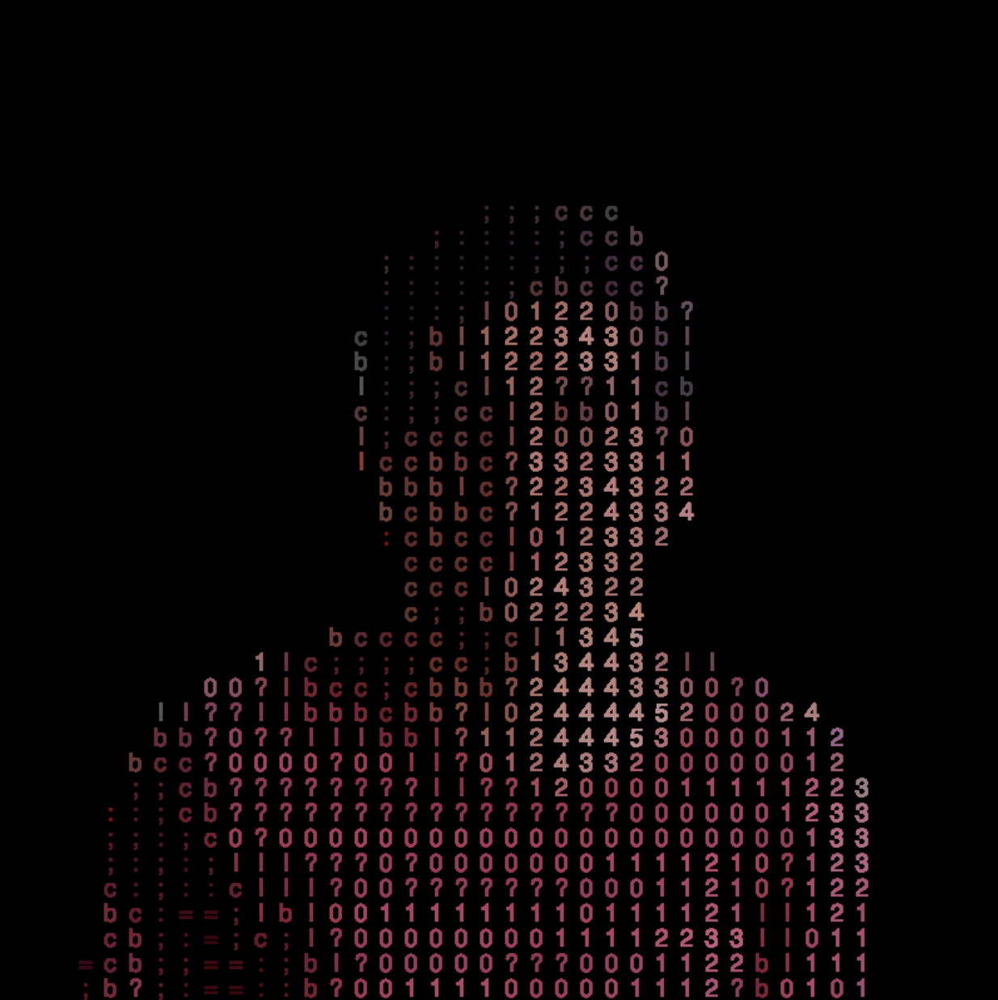

# Image made of text
This creates images made of text based on an image (using p5.js).



Inspired by The coding train (https://www.youtube.com/watch?v=55iwMYv8tGI) 

## First use
Install necessary node modules
```shell
npm install
```

## Usage
Build project
```shell
npm run build
```


Start server
```shell
live-server
```